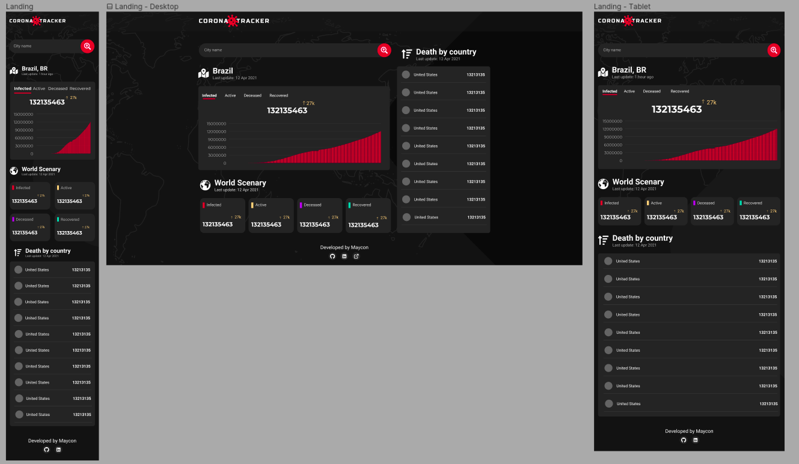
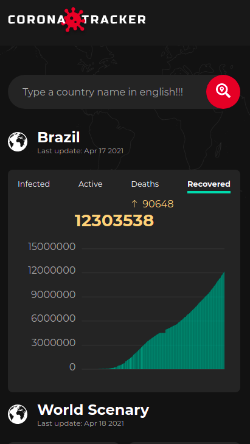
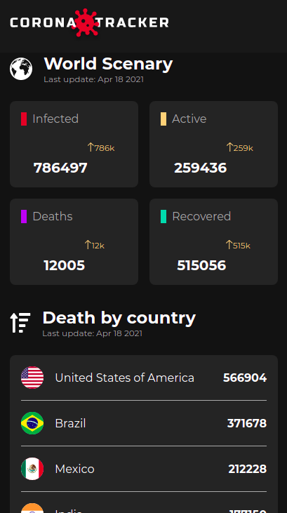
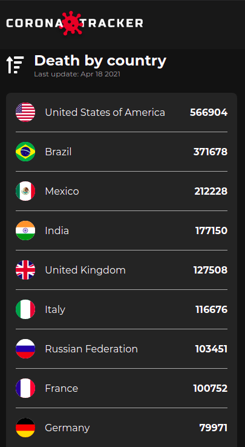
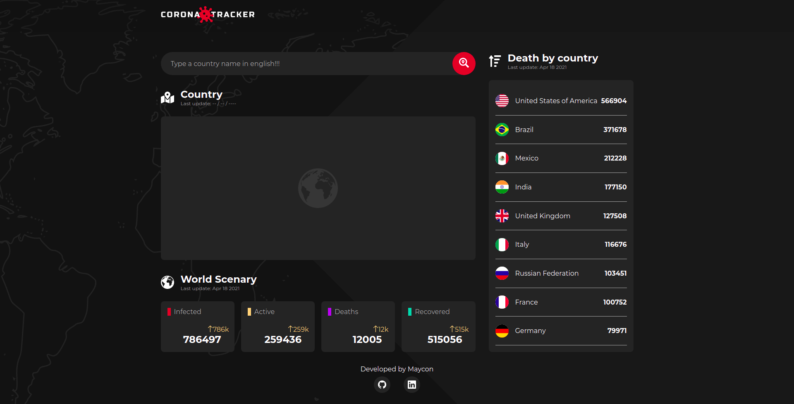
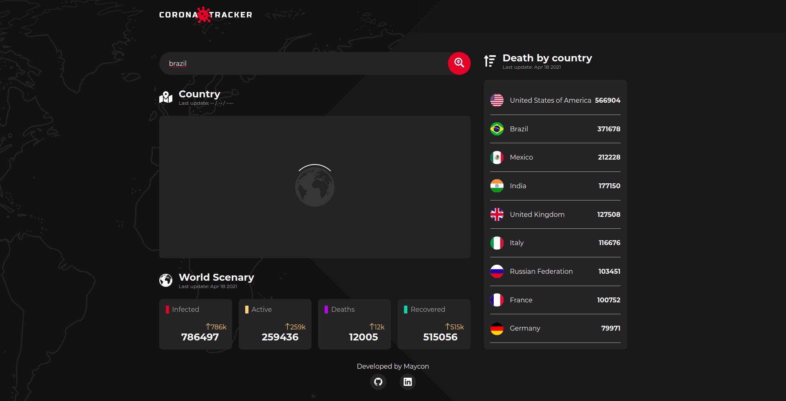
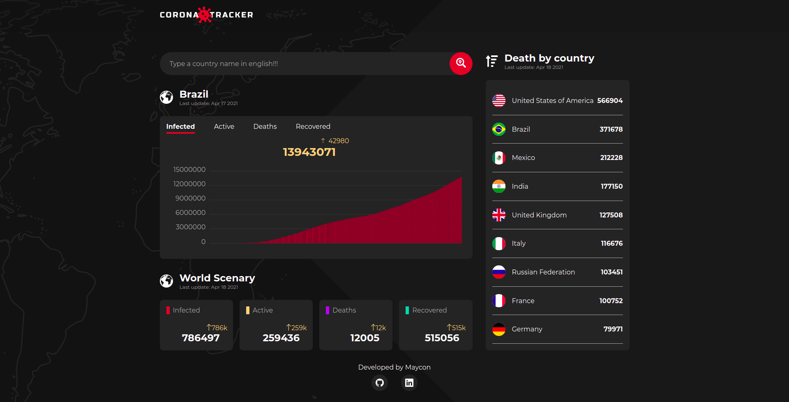

<h4 align="center"> 
	Projeto concluído! 
</h4>
<p align="left">Corona Tracker é uma aplicação que possibilita o usuário verificar a situação da pandemia do Corona Vírus no mundo. Todos os dados utilizados são dinâmicos e obtidos de uma api externa.</p>
<p>A aplicação é divida em três partes principais. A primeira parte permite que o usuário pesquise o país de sua escolha e verifique os dados de número de infectados, casos ativos, mortes e recuperados. As informações são apresentadas em texto e em gráficos com o uso do Appex Charts</p>
<p>A segunda parte é carregada automaticamente com as mesmas informações da primeira parte, porém agora para nível mundial. Já a terceira parte mostra o ranking dos países com base no número de mortes ocasionados pelo corona vírus. As informações de nível global são geradas estaticamente com revalidação a cada 12 horas através da utilização do getStaticProps disponível no NextJS</p>
<p>O design de toda a aplicação foi desenvolvido no Figma, garantindo melhor responsividade para a aplicação em telas desktop e mobile.</p>

### Tecnologias utilizadas
---

* NextJS
* TypeScript
* Styled Components
* Appex charts
* Covid 19 API
* Figma
* Date-FNS

### Features
---

- [x] Pesquisa dinâmica da situação da pandemia em cada país
- [x] Dados apresentados em formato de texto e em gráficos
- [x] Situação da pandemia em nível global
- [x] Ranking dos países com o maior número de mortes
- [x] Geração de dados estáticos para a situação mundial e para o ranking com o getStaticProps do NextJS

### Screenshots
---
* Projeto no Figma


* Mobile




* Web




### Como instalar
---

```bash
# Clone este repositório
$ git clone https://github.com/mayconrr13/corona-tracker.git

# Instale as dependências
$ yarn 

# Execute a aplicação
$ yarn dev

# Acesse a aplicação
$ http://localhost:3000
```

### Autor
---

Maycon dos Reis Rosário

### Entre em contato!

[](https://www.linkedin.com/in/mayconreisrosario/) 
[](mailto:mayconrr13@gmail.com)
